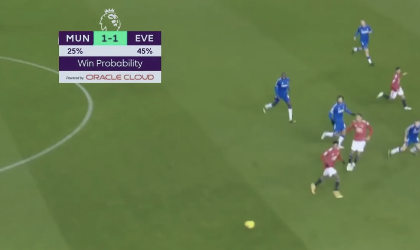
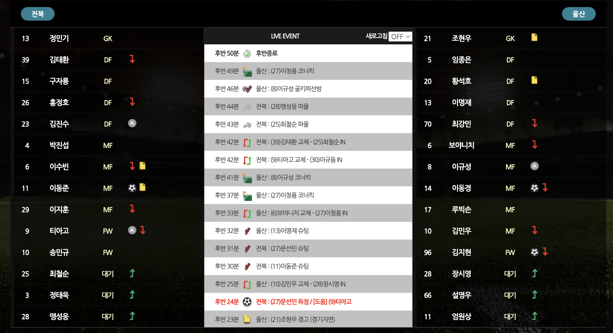
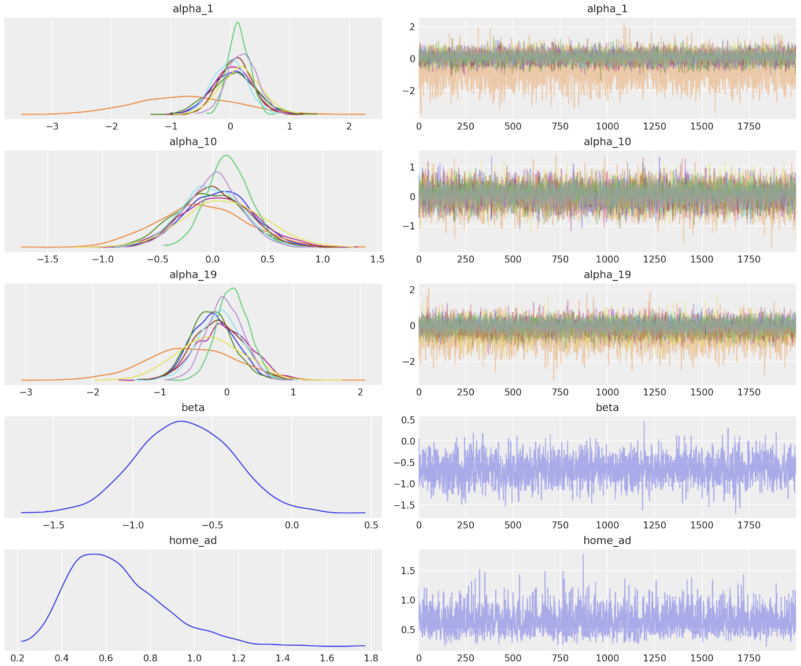
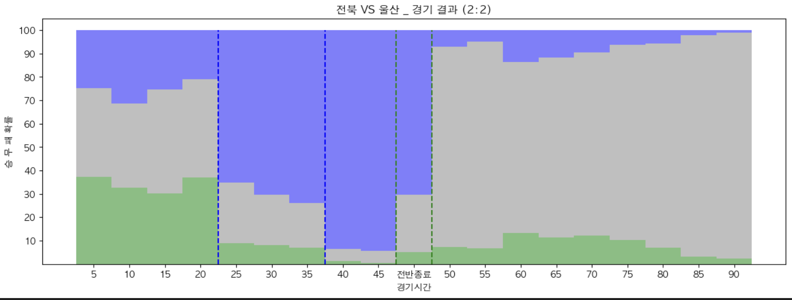

# in_game_win_probability_model
 Bayesian in-game win probability model for K-league based on Pieter Robberechts's model

## K-league 실시간 승리확률 예측 모형

실시간으로 제공되는 이벤트 데이터를 활용하여, 경기 시점마다의 각 팀의 승리확률을 예측하는 모형입니다.

- Premier league win probability model.

### K-league LIVE EVENT DATA
- [K-league 데이터 포털](https://data.kleague.com/) 에서 제공하는 실시간 이벤트 데이터
    - 골 
    - 슈팅 
    - 오프사이드 
    - 반칙 
    - 카드(경고, 퇴장) 

### 활용한 데이터
- 활용 가능한 K-league 데이터가 없어 [Statsbomb opendata](https://github.com/statsbomb/open-data) 활용.
   - PL, La Liga, Ligue1 814경기의 event data 활용
- 전 시즌 순위 및 해당 시즌 경기 결과로 elo-rating 값 산출. 

### 모델링
- Bayesian poisson model
- 베이지안 추론 [pymc](https://www.pymc.io/) package 활용.

### 모델 구조
- [베이지안 네트워크](graphical_structure.pdf)

### K-league 실시간 숭리확률 예측 예시
- 하나은행 K-League 4round
- 전북(홈) vs 울산(어웨이) 
- 경기일 : 2024/03/30
- 경기결과 : 2:2

### Reference
1. [Statsbomb opendata](https://github.com/statsbomb/open-data)
2. [K-League 데이터 포탈](https://data.kleague.com/)
3. [pymc](https://www.pymc.io/)
4. [Explaining Live Win Probability (LWP) - opta](https://theanalyst.com/eu/2021/11/live-win-probability/)
5. [Americal Soccer analysis](https://www.americansocceranalysis.com/home/2021/7/16/we-have-a-new-win-probability-model)
6. [Win probability model - Abhshek sharma](https://sharmaabhishekk.github.io/projects/win-probability-implementation)
7. [A Bayesian Approach to In-Game Win probability in soccer(2019)](https://dl.acm.org/doi/10.1145/3447548.3467194) P. Robberechts, Jan Van Harren, J. Davis
8. [A Bayesian approach to predict football matches with changed home advantage in spectator-free matches after the COVID-19 break(2022)](https://www.mdpi.com/1099-4300/24/3/366) J Lee, J Kim, H Kim, JS Lee

